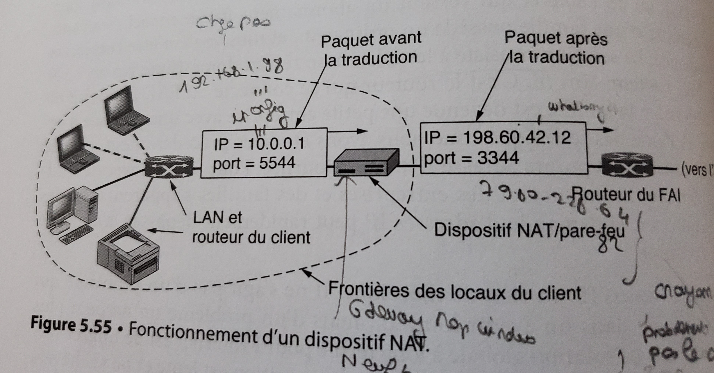

# NAT deep dive

I also recommend to read [Tanenbaum, Reseau 5eme edition] chapitre 5, La couche reseau, section 5.6: Couche reseau dans l'Internet (p465)

## Quoting Tanenbaum 

It only mentions S(ource)NAT.

[From Tanenbaum, Reseau 5eme edition] chapitre 5, La couche reseau, section 5.6: Couche reseau dans l'Internet (p465), Traduction d'adresse de reseau (NAT) (p481), p483



<!-- use OCR app -->

> Voici la demarche qu'ont suivie les concepteurs de NAT.
Ils ont remarqué que |a majorite des paquets IP incluent une charge utile TCP ou UDP.
Nous verrons au **chapitre 6 {page 576 et 592} que len-tete de ces deux protocoles contient un champ de port source et un champ de port de destination.** 
NAT s’appuie dessus pour fonctionner. L'explication qui suit prend pour exemple TCP, mais elle s’applique tout aussi bien a UDP.


> Lorsqu'un processus souhaite établir une connexion TCP avec un processus distant, 
Il s'attache a un port TCP sur la machine locale, appelé port TCP source.
Ce port indique au code TCP vers quel processus diriger les paquets TCP entrants sur cette connexion.
Le processus local désigne également un port TCP de destination qui specifie le processus auquel remettre les paquets
une fois qu ils sont arrivés sur I’hote distant.
Les numéros 0 a 1 023 correspondent a des ports réservés.
Par exemple, le port 80 est utilisé par les serveurs web pour permettre aux clients distants de les localiser. 
Chaque message TCP renferme un numéro de port source et un numéro de port de destination.
Les numéros de ports sont des entiers codés sur 16 bits qui identifient les processus aux deux extrémités d’une connexion.

> Pour mieux comprendre l'utilité des ports, procédons par analogie.
Imaginons une société qui dispose d’un numéro de téléphone principal. Lorsque des personnes composent ce numero,
elles obtiennent une standardiste qui leur demande le numéro du poste de leur interlocuteur et les met en contact.
Le numéro principal est semblable al’adresse IP du client, et les extensions des deux interlocuteurs sont analogues aux numéros de ports. Les ports constituent en fait un adressage sur 16 bits supplémentaire qui identifie les processus recevant le paquet entrant.

> Revenons-en maintenant au fonctionnement de NAT.
Lorsqu’un paquet envoyé en sortie arrive sur le dispositif NAT, 
l’adresse source 10.x.y.z. est remplacée par l’adresse IP du client.
De plus, le champ Port source TCP est remplacé par une référence a une entrée de la table de traduction de 65 536 adresses du dispositif NAT.
Cette **entrée inclut l'adresse IP et le port source d’origine**. 
Ensuite, les totaux de controle IP et TCP sont recalculés et insérés dans le paquet. 
**Il est nécessaire de remplacer le champ Port source. En effet, les machines 10.0.0.1 et 10.0.0.2,
par exemple, pourraient toutes deux avoir initié une connexion sur le port 5000, auquel cas le numéro port source ne suffrait pas pour identifier le processus émetteur.**


> **Lorsqu’un paquet arrive sur le dispositif NAT en provenance du FAI, le champ Port source de l’en-téte TCP est extrait et utilisé comme pointeur dans la table de correspondances du dispositif NAT. Une fois l’entrée correspondante localisée, l’adresse IP interne et le champ Port source TCP dorigine indiqués sont récupérés et insérés dans le paquet.**
Les totaux de contréle sont aussi recalculés. Le paquet est ensuite transmis au routeur du client qui le remet a l’adresse 10.x.y.Z..approprice.

> **NAT peut aussi servir a pallier le manque d’adresses IP pour les utilisateurs service ADSL et du cable.
Le FAI assigne alors une adresse 10.x.y.27 a un dad abonne.
Lorsque les paquets de ces utilisateurs quittent le site du FAI pour entrer sur l’'Internet, 
ils passent par un dispositif NAT qui leur applique l’adresse IP du FAI.**


## Comments

### Prereq

Read https://github.com/scoulomb/misc-notes/blob/master/NAS-setup/Wake-On-LAN.md
And all section marked as 
`[From Tanenbaum, Reseau 5eme edition] chapitre 5, La couche reseau, section 5.6: Couche reseau dans l'Internet (p465)....`

### Source port

Note that source port (used by NAT) is usually randomly chosen by OS but can enforce it
From  
- https://stackoverflow.com/questions/2694212/python-set-source-port-number-with-sockets,
- https://stackoverflow.com/questions/40971040/specifying-source-ip-address-for-socket-connect-in-python-sockets
Use `socket.bind((ipaddr, port))` 

For instance here https://github.com/scoulomb/http-over-socket/tree/main/1-client

A fw rule is usually (source ip, dest ip, dest port). But could have source port.

For example we can observe a request to github.
Go to Wireshark, shoot github.
Filter `ip.src==192.168.1.90 and ip.dst==140.82.121.4`

Where `ip.src` is laptop IP on LAN and `ip.dst` is 
````
scoulomb@scoulomb-HP-Pavilion-TS-Sleekbook-14:~$ nslookup 140.82.121.4
4.121.82.140.in-addr.arpa name = lb-140-82-121-4-fra.github.com.
````

And `File` > `Export packet dissection` > `As plain text` [here](media/github-export.txt).

Let's take a frame (see comment `#`)

`````shell
No.     Time           Source                Destination           Protocol Length Info
    124 2.790396401    192.168.1.90          140.82.121.4          TCP      66     47030 → 443 [ACK] Seq=1293 Ack=2973 Win=64128 Len=0 TSval=2610848394 TSecr=4212279757

Frame 124: 66 bytes on wire (528 bits), 66 bytes captured (528 bits) on interface wlo1, id 0
Ethernet II, Src: LiteonTe_c5:99:c1 (20:68:9d:c5:99:c1), Dst: Sfr_62:df:48 (e4:5d:51:62:df:48)
    Destination: Sfr_62:df:48 (e4:5d:51:62:df:48)   
    
    # Ethernet Layer, we target the BOX IP
    # See https://github.com/scoulomb/misc-notes/blob/master/NAS-setup/Wake-On-LAN.md#reminder-on-arp
    # Case where Ethernet address is not in LAN and accumulation with NAT
    # We have DNS query, ARP request and NAT table updated, then TLS (client hello) and OCSP (https://github.com/scoulomb/misc-notes/tree/master/tls) via NAT betwen box and github endpoint 
    # Github endpoint can have load lancer with fw in front, and router in between (with intermediate NAT).
    # see Link with private_script/tree/main/Links-mig-auto-cloud - stop diving
    
    Source: LiteonTe_c5:99:c1 (20:68:9d:c5:99:c1)   
    
    # Laptop Ethernet card mac
    
    Type: IPv4 (0x0800)
Internet Protocol Version 4, Src: 192.168.1.90, Dst: 140.82.121.4

    # Can see source IP laptop which will be Natted
    
    0100 .... = Version: 4
    .... 0101 = Header Length: 20 bytes (5)
    Differentiated Services Field: 0x00 (DSCP: CS0, ECN: Not-ECT)
    Total Length: 52
    Identification: 0x77e9 (30697)
    Flags: 0x40, Don't fragment
    Fragment Offset: 0
    Time to Live: 64
    Protocol: TCP (6)
    Header Checksum: 0xfb81 [validation disabled]
    [Header checksum status: Unverified]
    Source Address: 192.168.1.90
    Destination Address: 140.82.121.4
Transmission Control Protocol, Src Port: 47030, Dst Port: 443, Seq: 1293, Ack: 2973, Len: 0
    Source Port: 47030
    Destination Port: 443
    
    # Here we are Source Port and Destination Port
    # Will be used to build the NAT table, See figure 5.55
    # Even when NAT is not masquerade (as in Docker), this mapping is not visible directly, --to-source is the range for natting (many to many) https://www.inetdoc.net/guides/iptables-tutorial/snattarget.html
    
    [Stream index: 3]
    [TCP Segment Len: 0]
    Sequence Number: 1293    (relative sequence number)
    Sequence Number (raw): 4251858603
    [Next Sequence Number: 1293    (relative sequence number)]
    Acknowledgment Number: 2973    (relative ack number)
    Acknowledgment number (raw): 2569120225
    1000 .... = Header Length: 32 bytes (8)
    Flags: 0x010 (ACK)
    Window: 501
    [Calculated window size: 64128]
    [Window size scaling factor: 128]
    Checksum: 0x39d7 [unverified]
    [Checksum Status: Unverified]
    Urgent Pointer: 0
    Options: (12 bytes), No-Operation (NOP), No-Operation (NOP), Timestamps
    [SEQ/ACK analysis]
    [Timestamps]
`````

Then here we explained how [Ethernet frame](https://en.wikipedia.org/wiki/Ethernet_frame) is received: https://github.com/scoulomb/misc-notes/blob/master/NAS-setup/Wake-On-LAN.md#reminder-on-arp
>  Maintenant que le logiciel IP de l’hote 1 détient l'adresse Ethernet de l’hote 2, ....
Where is the IP is not in the LAN.

We can see source IP in TCP/(UDP) datagram encapsulated in ethernet frame.
See https://stackoverflow.com/questions/31446777/difference-between-packets-and-frames/31464376#31464376

This source port can also be seen [Wake on LAN request](https://github.com/scoulomb/misc-notes/blob/master/NAS-setup/Wake-On-LAN.md#wol---how-does-it-work) as explained in that section.
<!-- OK -->
Example given in this [link](https://github.com/scoulomb/misc-notes/blob/master/NAS-setup/media/wireshark-export-android-wol-192-168-1-255.txt).

<!--
p474
Division de prefixe IP (apply mask to know to which network to route)
p477 (routage CIDR)
aggregation de prefixe IP (entry in route table) et aggregation avec Route la plus specifique, <=> dans celle du plus long prefixe correspondant ayant le moins d'adresse ip,
p504 
Routage intradomaine OSPF (to auto add entty in route table) 
p510
Routage interdomaine BGP (to auto add entry in route table)

private_script/tree/main/Links-mig-auto-cloud, for migration prefix and BGP, do not enter in details stop

-->

### Type of SNAT


From picture we have

|      | Before translation    | After Translation        |
|------|-----------------------|--------------------------|
| IP   | 10.0.0.1 (private IP) | 198.60.42.12 (public IP) |
| Port | 5544                  | 3344                     |


What Kind of (S)ource NAT do we have?

From https://fr.wikipedia.org/wiki/Network_address_translation => https://www.ciscomadesimple.be/2013/04/06/configuration-du-nat-sur-un-routeur-cisco/

and https://www.cisco.com/c/en/us/td/docs/ios-xml/ios/ipaddr/command/ipaddr-cr-book/ipaddr-i3.html#wp1284532593

We will see same pattern is working it can also be applied to
- All kind of SNAT
- DNAT

#### Source NAT: Static NAT (one to one)

Quoting  https://www.ciscomadesimple.be/2013/04/06/configuration-du-nat-sur-un-routeur-cisco/ (forked [here](media/configuration-du-nat-sur-un-routeur-cisco/configuration-du-nat-sur-un-routeur-cisco.htm))

>  Nous allons explicitement indiquer au routeur que ce qui arrive sur son interface publique (S0/0) et dont l’adresse destination est 201.49.10.30 (une des adresse du pool publique) doit être redirigé vers 192.168.1.100.

See DNAT [below](#what-about-destination-nat).

> Du point de vue du routeur cela revient à modifier l’adresse IP destionation dans l’en-tête IPv4 avant de router le paquet. Cela signifie aussi que si C3 envoi un paquet vers internet, à la sortie de S0/0 de R1 l’adresse source (192.168.1.100) sera remplacée par l’adresse indiquée dans la translation, soit 201.49.10.30.

````
R1(config)#ip nat inside source static 192.168.1.100 201.49.10.30
````

In [Ciso doc](https://www.cisco.com/c/en/us/td/docs/ios-xml/ios/ipaddr/command/ipaddr-cr-book/ipaddr-i3.html#wp1284532593) this is 

````
ip nat inside source/Static NAT

ip nat inside source static {esp local-ip interface type number | local-ip global-ip} [extendable] [no-alias] [no-payload] [route-map name [reversible]] [redundancy {group-name | rg-id mapping-id mapping-id}] [reversible] [vrf name [match-in-vrf] [forced]]

````
We can also have port static NAT. 
In [Ciso doc](https://www.cisco.com/c/en/us/td/docs/ios-xml/ios/ipaddr/command/ipaddr-cr-book/ipaddr-i3.html#wp1284532593) this is 

````
ip nat inside source/Port Static NAT

ip nat inside source static {tcp | udp} {local-ip local-port global-ip global-port [extendable] [forced] [no-alias] [no-payload] [redundancy {group-name | rg-id mapping-id mapping-id}] [route-map name [reversible]] [vrf name [match-in-vrf]] | interface global-port} 
````


#### Source NAT: NAT with pool of address (many to many)

##### Simple 

Quoting  https://www.ciscomadesimple.be/2013/04/06/configuration-du-nat-sur-un-routeur-cisco/


> Ici, au lieu de configurer une translation statique, nous allons donner au routeur une plage d’adresses publiques (un pool d’adresse) dans laquelle il peut piocher pour créer dynamiquement les translations

````
# Tout d’abord créons le pool d’adresses
R1(config)#ip nat pool POOL-NAT-LAN2 201.49.10.17 201.49.10.30 netmask 255.255.255.240
# Il nous faut ensuite définir quelles adresses IP sources seront susceptibles d’êtres translatées … pour cela il faut créer une ACL.
R1(config)#access-list 1 deny 192.168.1.100
R1(config)#access-list 1 permit 192.168.1.0 0.0.0.255
# Il ne reste plus qu’à configurer le NAT en lui même

R1(config)#ip nat inside source list 1 pool POOL-NAT-LAN2

# On instruit donc ici le routeur de créer dynamiquement une translation pour les paquets arrivant sur une interface « inside » routés par une interface « outside » dont l’adresse IP source correspond à l’ACL 1 et de remplacer l’IP source par une de celles comprises dans le pool POOL-NAT-LAN2.
````


In [Ciso doc](https://www.cisco.com/c/en/us/td/docs/ios-xml/ios/ipaddr/command/ipaddr-cr-book/ipaddr-i3.html#wp1284532593) this is 

````
ip nat inside source/Dynamic NAT

ip nat inside source {list {access-list-number | access-list-name} | route-map name} {interface type number | pool name [redundancy rg-id mapping-id mapping-id]} [no-payload] [overload] [c] [vrf name [match-in-vrf]] [oer] [portmap name] 
````

Where `pool name` is used 


##### Overload - PAT


Quoting  https://www.ciscomadesimple.be/2013/04/06/configuration-du-nat-sur-un-routeur-cisco/
> **Attention, si il y a plus de machine dans le réseau privé que d’adresses publiques disponibles, il faut alors rajouter le mot clé « overload » à la commande:**

````

R1(config)#ip nat inside source list 1 pool POOL-NAT-LAN2 overload

# Ceci permet de « partager » les adresses publiques en translatant également les numéros de ports dans l’entête de la couche transport (méthode communément appelée PAT).
# For me it si the biggest advantage of NAT

````

This is the nominal case of Tanenbaum.

#### Configuration du NAT dynamique avec surcharge (sans pool) (many to one)

Quoting  https://www.ciscomadesimple.be/2013/04/06/configuration-du-nat-sur-un-routeur-cisco/

> Il reste encore à configurer R2 pour que le réseau 192.168.0.0/24 puisse accéder à l’extérieur. Pour cela nous allons configurer le troisième type de NAT, à savoir du NAT dynamique avec surcharge (overload) en utilisant l’adresse publique configurée sur l’interface S0/0 de R1.

> Notez que c’est la configuration la plus courante dans un réseau modeste (par exemple dans un réseau domestique). Cette méthode ne requiert pas d’obtenir de nouvelles adresses publiques auprès du provider.

> Nous devons cette fois aussi identifier les adresses sources à faire passer par le NAT, donc nous créons une nouvelle ACL.

````
R1(config)#access-list 2 permit 192.168.0.0 0.0.0.255
````

Il ne reste plus qu’à configurer le NAT.

````
R1(config)#ip nat inside source list 2 interface serial 0/0 overload
````


Nous disons ici au routeur de translater les paquets provenant des adresses décrites dans l’ACL 2 (192.168.0.0/24) et de remplacer l’adresse IP source par celle configurée sur l’interface Serial 0/0 en la surchargeant pour permettre à plus d’une machine de communiquer avec l’extérieur (PAT).


In [Cisco doc](https://www.cisco.com/c/en/us/td/docs/ios-xml/ios/ipaddr/command/ipaddr-cr-book/ipaddr-i3.html#wp1284532593) this is also `ip nat inside source/Dynamic NAT` with `interface serial`.

This is also the nominal case of Tanenbaum.

### What about D(estination) NAT

#### Use `static` D(estination) NAT

We should use same command as static [S(ource)NAT](#source-nat-static-nat-one-to-one)
Quoting this post https://community.cisco.com/t5/routing/destination-nat/td-p/2528980

> What you are looking for is in reality a static source NAT. I know that you intend to rewrite the destination of the packets coming from internet to your router so that they can reach your internal server at 10.0.0.4. However, the names "source NAT" and "destination NAT" apply to the traffic that flows from the inside to the outside interface, i.e. from your internal LAN going off to the internet. It is only natural that in the return traffic, the opposite addresses are rewritten, i.e. if the source NAT rewrites the source IP in the traffic going from inside to outside, it will also rewrite the destination IP in the traffic going from outside to inside.

> So simply look for a typical static source NAT configuration. While I do not know what ASR you are running (if it is IOS-XE or IOS-XR), on plain IOS, this would be very simple:

> `ip nat inside source static 10.0.0.4 12.34.56.78`
> or, with port forwarding:

> `ip nat inside source static tcp 10.0.0.4 80 12.34.56.78 80`.

So we can use static: `ip nat inside source static`.

#### ip nat outside

We should not confuse with `ip nat outside source`

From
- https://www.cisco.com/c/en/us/support/docs/ip/network-address-translation-nat/13772-12.html#topic12
- https://www.cisco.com/c/en/us/support/docs/ip/network-address-translation-nat/13773-2.html

<!-- order switch inside/outside between the 2 docs -->

- ip nat inside source	
    - Translates the source of IP packets that are traveling inside to outside. [case NI SRC]
    - Translates the destination of the IP packets that are traveling outside to inside.  [case NI DST]

- ip nat outside source	
    - Translates the source of the IP packets that are traveling outside to inside.  [case NO SRC]
    - Translates the destination of the IP packets that are traveling inside to outside. [case NO DST]

I judge this article confusing (ignore) https://networkinterview.com/nat-configuration-nat-types-palo-alto/

Note
- When we do standard S(ource) NAT we configure [case NI SRC], but reverse traffic is actually doing  [case NI DST]
- When we do standard D(estination) NAT we configure [case NI DST], but reverse traffic is actually doing  [case NI SRC]


Above in [source NAT static](#source-nat-static-nat-one-to-one), we actually saw it was working for DNAT too.

#### Use `ip nat inside destination` 


In case we have 
> To enable the Network Address Translation ( NAT) of a globally unique outside host address to multiple inside host addresses, use the ip nat inside destination command in global configuration mode. This command is primarily used to implement TCP load balancing by performing destination address rotary translation. To remove the dynamic association to a pool, use the no form of this command.

````
ip nat inside destination list {access-list-number | name} pool name [redundancy redundancy-id mapping-id map-id] `
````

### SFR Box

It does
- Implicit S(ource) NAT which is the case  [Configuration du NAT dynamique avec surcharge (sans pool) (many to one)](#configuration-du-nat-dynamique-avec-surcharge-sans-pool-many-to-one)
- DNAT at http://192.168.1.1/network/nat, which is the case [Use `static` D(estination) NAT](#use-static-destination-nat).


### See also F5 SNAT:


#### F5 NATS and SNATs

From: https://techdocs.f5.com/kb/en-us/products/big-ip_ltm/manuals/product/tmos-routing-administration-11-6-0/7.html
Forked [here](./media/tmos-routing-administration-11-6-0/AskF5%20_%20Manual%20Chapter_%20NATS%20and%20SNATs.html).

##### Section `About NATs`

- Without NAT (use virtual server) => This is a kind of [case NI SRC] DNAT
- With a NAT
  - NAT for inbound connection    => This is  [case NI DST] DNAT
  - NAT for outbound connection   => This is  [case NI SRC] SNAT 
So ip NAT inside only
    
From: https://techdocs.f5.com/kb/en-us/products/big-ip_ltm/manuals/product/tmos-routing-administration-11-6-0/7.html

##### Section `About SNATs`

> A secure network address translation (SNAT) is a BIG-IP Local Traffic Manager feature that translates the source IP address within a connection to a BIG-IP system IP address that you define. 
> The destination node then uses that new source address as its destination address when responding to the request.

> For inbound connections, that is, connections initiated by a client node, SNATs ensure that server nodes always send responses back through the BIG-IP system, 
> when the server’s default route would not normally do so. 
> Because a SNAT causes the server to send the response back through the BIG-IP system,
> the client sees that the response came from the address to which the client sent the request, and consequently accepts the response.

> For outbound connections, that is, connections initiated by a server node, SNATs ensure that the internal IP address of the server node remains hidden to an external host when the server initiates a connection to that host.


--- **Inbound connection**

> In the most common client-server network configuration, 
the Local Traffic Manager standard address translation mechanism ensures that server responses return to the client through the BIG-IP system, 
thereby reversing the original destination IP address translation. This typical network configuration is as follows:

    The server nodes are on the same subnet as the BIG-IP system.
    The client nodes are on a different subnet from the server nodes.
    The BIG-IP system is the default gateway for the server subnet. 

> However, there are atypical network configurations in which the standard BIG-IP system address translation sequence by itself does not ensure that server responses use the required return path.

Examples: `When the default gateway of the server node is not the BIG-IP system`

> For various reasons, the server node’s default route cannot always be defined to be a route back through the BIG-IP system. 
Again, this can cause problems such as the client rejecting the response because the source of the response does not match the destination of the request. 
The solution is to create a SNAT. 
> When Local Traffic Manager then translates the client node’s source IP address in the request to the SNAT address, 
this causes the server node to use that SNAT address as its destination address when sending the response. 
This, in turn, forces the response to return to the client node through the BIG-IP system rather than through the server node’s default gateway.

See diagram in page!

 Here we have a kind of standard DNAT at virtual server.
**And S(ource)NAT between F5 and gateway/server/esb etc...**. This is still standard S(ource) NAT.

This is convenient when F5 are in different network than server (ex. POP/Azure) to ensure reverse traffic come back to F5 (usually SNAT pool attached to vs, see below). 
<!--LIC::cloudification::SNAT, loss of proximity-->

Example where default gateway on the route does not require source ip packet change as here: https://github.com/scoulomb/misc-notes/blob/master/NAS-setup/Wake-On-LAN.md#android-wow

--- **SNATs for server-initiated (outbound) connections**

> When an internal server initiates a connection to an external host, a SNAT can translate the private, source IP addresses of one or more servers within the outgoing connection to a single, publicly-routable address. The external destination host can then use this public address as a destination address when sending the response. In this way, the private class IP addresses of the internal nodes remain hidden from the external host.
> More specifically, a SNAT for an outgoing connection works in the following way:

> 1. Local Traffic Manager receives a packet from an original IP address (that is, an internal server with a private IP address) and checks to see if that source address is defined in a SNAT.
> 2. If the original IP address is defined in a SNAT, Local Traffic Manager changes that source IP address to the translation address defined in the SNAT.
> 3. Local Traffic Manager then sends the packet, with the SNAT translation address as the source address, to the destination host.

Here they mention use-case of DNS request: From https://support.f5.com/csp/article/K7820

This is S(ource) NAT [case NI SRC], but reverse traffic is actually doing  [case NI DST]


**Warning**: SNAT in F5 means "secure" (`S` is confusing can mean Source, Static and Secure....)

--- **Types of S(ecured)NATs**

- Standard SNAT object: 
  - specific translation address (one to one)
  - Automap SNAT: many to many
  - SNAT pools: many to many (https://support.f5.com/csp/article/K47945399)
- SNAT pool assinged to virtual server
- intelligent SNAT (irule)

#### Virtual server + NAT + SNATs

I completed algo from https://support.f5.com/csp/article/K7820 with NAT
Forked [here](media/f5-k7820/f5-k7820.html).

1. The BIG-IP system receives a request directly from a client or from virtual server traffic
2. If  virtual server and ` Source Address Translation property` defined  in virtual server in BIG-IP system translates the source IP address to the translation address defined
3. Else BIG IP verifies whether that source IP address is defined in the origin address list for NAT or S(ecured)NAT (NAT has higher precedence: https://support.f5.com/csp/article/K9038).
4. If the client's IP address is defined in the origin address list for the NAT/S(ecured)NAT, 
the BIG-IP system translates the source IP address to the translation address defined in NAT/S(ecured)NAT object
(after the traffic has already matched a virtual server if virtual server (and if virtual server's pool allow SNAT set to true): https://clouddocs.f5.com/cli/tmsh-reference/v14/modules/ltm/ltm_pool.html
5. The BIG-IP system then sends the client request to the pool member or other destination (egress) being inbound or outbound (see above, DNS in section SNATs for server-initiated (outbound) connections)

<!-- match also --- **SNATs for server-initiated (outbound) connections** -->

Note SNAT at vs level avoids to define `Source Address Translation property` in each virtual server.


See here https://clouddocs.f5.com/cli/tmsh-reference/v15/modules/ltm/ltm_virtual.html:
`source-address-translation` property (replacing `snat`, `snatpool`).
To not confuse with `source` which specifies an IP address or network from which the virtual server will accept traffic.

#### Pellicular case for outbound 

We can use virtual server for outbound connection (SNAT pool assigned to virtual server) to perform SNAT when sending traffic to external provider

- Standard virtual server (explicit SNAT)
- Using forwarding virtual server: https://support.f5.com/csp/article/K7595

See https://support.f5.com/csp/article/K93100324#link_07_01

Same mechanism used as in **SNAT between F5 and gateway/server/esb etc...**.
<!--LIC::cloudification::explicit SNAT removal -->
<!--LIC::migration::case outbound on prem, replaced by fw in cloud -->
<!--LIC::migration:: for inbound/outbound farm, no big bang, can renat own DC to POP to use same IP in different loc -->


<!-- NAT box is opening a new TCP connection (p483) it even modifies the packet,
Router does not go to TCP layer -->

<!-- p472
Un réseau correspond a un bloc contigu d’espace d’adressage IP.
C'est ce que on appelle un préfixe,
Les adresses IP sont écrites en notation décimale pointée
Dans cette forme un des 4 octets est représenté par un nombre décimal compris entre 0 et 255.
Dans l'exemple, l'adresse hexadécimale sur 32 bits 80D00297 equivaut  a 128.208.2.15 en notation décimale pointée.
On écrit les préfixed en indiquant l'adress IP la plus basse dans le bloc et la taille du bloc.
Cette taille est déterminde par le nombre de bit dans la partie réseau ;
les bits restants dans la partie hote sont variables
Autrement dit, la taille doit etre une puissance de 2.
Par convention, elle est notée a la suite de l'adresse IP du préfixe par une barre oblique (slash)
suivie par la bongueur en bits de la partie reseay
Dans notre exemple, si le préfixe content 2^8 adressse, ce qui laisse 24 bits pour la partie réseau, 
on |’écrit 128.208.0.0/24.
Comme on ne peut pas deduire,la longueur du préfixe uniquement a partir de Tadresse IP, 
les protocoles de routage doivent rarismettre les préfixes aux routeurs. 
Les préfixes sont parfois decrits simplement par leur longueur, comme « /16 » (slash 16).
La longueur du prefixe correpond a un Masque binaire de 1 dans la partie réseau. 
Ecrit sous cette forme.il se nommede sous-réseau.
On peut l’associer avec l’adresse IP au moven d'une operation booleane AND, ou ET logique, pour obtenir la partie reseau seulement
Dans notre exemple, le masque de sous-réseau est 255.255.255.0. La figure 5.48 montre
un prefixe et un masque de sous-réseau. 

p474
routeur reqarde adresse, applique chaque masque de sous reseau (donc garde la partie reseau)
si un reseau match sait ou router !

https://github.com/scoulomb/misc-notes/blob/master/NAS-setup/Wake-On-LAN.md#wol---how-does-it-work
Bottom of page 

We see 192.168.1.255 as broadcast IP
Which means than network mask is 255.255.255.0

And it matches setup we can see in DENON
IP:192.168.1.33
Subnet mask:255.255.255.0
Gateway: 192.168.1.1 => addresse la plus basse, coherent p499 *in bold*
DNS:192.168.1.1 => then fwd to SFR DNS (details in mydns)

vs usually inbound but could be outbound, think compatible stop here
-->

See links to private_script/blob/main/Links-mig-auto-cloud/README.md#topics <!-- clear ok ! -->


## Google router and double NAT

Also at home with Google wifi

````
Google WIFI network <=> Box network <=> internet
````

If NAS on box network via ethernet, we can access NAS from device in google wifi network (SNAT)
But if home assistant is on the NAS, to access smart speaker on Google WIFI network need to configure DNAT (in google home app) and use router WAN IP
So that it targets speaker, port to use is 1255 (from heos cli pdf sepc). It  will see the 2 speaker (home 150, avr)

With this configuration we also have issue for UPNP when on different network (media server on NAS and remote control app: https://github.com/open-denon-heos/heospy/blob/main/heospy/ssdp.py#L38)

Better to connect NAS to ethernet port
https://support.google.com/googlenest/answer/6277579?hl=fr

## SNAT and Azure

- Azure SNAT overview:  https://learn.microsoft.com/en-us/azure/load-balancer/load-balancer-outbound-connections
    - The following methods are Azure's most commonly used methods to enable outbound connectivity:

    | # | Method | Type of port allocation | Production-grade? | Rating |
    | ------------ | ------------ | ------ | ------------ | ------------ |
    | 1 | Use the frontend IP address(es) of a load balancer for outbound via outbound rules | Static, explicit | Yes, but not at scale | OK | 
    | 2 | Associate a NAT gateway to the subnet | Dynamic, explicit | Yes | Best | 
    | 3 | Assign a public IP to the virtual machine | Static, explicit | Yes | OK | 
    | 4 | [Default outbound access](../virtual-network/ip-services/default-outbound-access.md) use | Implicit | No | Worst |

    - Port exhaustion 
        - Every connection to the **same destination IP and destination port will use a SNAT port**. This connection maintains a distinct traffic flow from the backend instance or client to a server. This process gives the server a distinct port on which to address traffic. Without this process, the client machine is unaware of which flow a packet is part of.
        - Without different destination ports for the return traffic (the SNAT port used to establish the connection), the client will have no way to separate one query result from another
        - Outbound connections can burst. A backend instance can be allocated insufficient ports. Use connection reuse functionality within your application. Without connection reuse, the risk of SNAT port exhaustion is increased.
        - ==> SNAT port reuse is possible only if destination IP and/or destination Port i


- Load balancer SNAT: Load balancer can do SNAT but better to use SNAT gateway
    - https://learn.microsoft.com/en-us/azure/virtual-network/nat-gateway/tutorial-nat-gateway-load-balancer-public-portal
    - https://learn.microsoft.com/en-us/azure/load-balancer/outbound-rules (similar to forwarding vs)

- SNAT gateway
    - https://learn.microsoft.com/en-us/azure/virtual-network/nat-gateway/nat-gateway-resource?source=recommendations#source-network-address-translation (SNAT port reuse wrong, https://github.com/MicrosoftDocs/azure-docs/pull/103407, consider OK)
    - https://learn.microsoft.com/en-us/azure/virtual-network/nat-gateway/quickstart-create-nat-gateway-portal

<!-- above SNAT F5-GW outbound POP->AZ, here outbound AZ -> External world, stop here, DNAT stop -->
<!-- ok -->
<!-- reconcluded 30.12.22 + 4.01.23 with Azure -->

