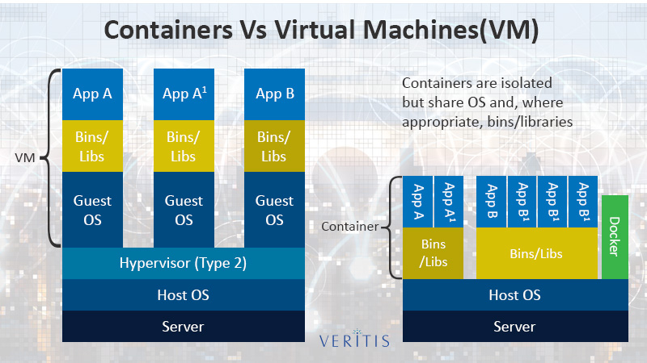

## Image

### Definition
It's a tarball containing:

- Metadata (json files: image name, env variables, command, entry-point, architecture, etc.)
- Directories and files

Each layer is stored as a different tarball.
The first layer contains the main filesystem.
Each subsequent layer contains the diff (what was added/removed).

See [investigation](./docker-image-deep-dive.md)

Add: file is added in the correct path;
Remove: TODO

Limitation: a given image contains binaries, and therefore only works for a
specific CPU architecture (see metadata).

Corollary: the JVM is still useful: it will still compile the bytecode to
machine code on the fly, no matter the CPU architecture.

Limitation: the os is specified, and so a Linux image can only run on a Linux host,
and same for all other OSs (or in a VM/VM-like: wsl is a Linux VM for Windows
allowing that, there is a similar VM on MacOS to run Linux images).

WSL is [not exactly a traditional VM](https://docs.microsoft.com/en-us/windows/wsl/compare-versions).

Some images are for Windows (ex: Windows 11 docker images): https://hub.docker.com/_/microsoft-windows-base-os-images
Windows can use Hyper-V or not (if the windows version of the image is different
from the one of the host).

### Consequences
When compiling a C++ program, the output can only run if:
- the CPU architecture is the same;
- the libc is the same (the libc depends on the OS. Ex: Linux: libc, glibc, muslc (Alpine), Windows: libvs2021, MacOS: ??)

When packaging a program written in C++ inside an image,
the libc version is assured to be the needed one.

When packaging a JVM jar/war, it can only be run if:
- a JVM has been compiled for the OS and CPU architecture targetted.

You can download the JVM for a given OS and CPU arch:
https://www.azul.com/downloads/?version=java-17-lts&os=linux&package=jdk

=> the end-user doesn't have to know/compile the program for any architecture.

(JVM JIT will compile the classes on the fly for you):
JVM languages are interpreted and compiled.

=> that's why there is a small warm-up of the JVM.

If you deliver a jar/war, only 1 is needed for all CPU architectures and OSs.

Images negate this advantage.

Image fix all the environment: _all_ files (including dynamic libraries),
_all_ env. variables, etc.

## Container

### Definition
It's filesystem running in a namespace (isolation: filesystem, network, time, etc.)
with some cgroups (Resources isolation) limits applied.

- namespaces: https://en.wikipedia.org/wiki/Linux_namespaces
- cgroups: https://en.wikipedia.org/wiki/Cgroups

Note: cgroups _can_ be seen as a namespace.

The cgroup limits are not part of the image, and are decided when starting the
container (eg: kubernetes requests/limits).

The container runs the binary only sharing the host's Linux kernel.

This is handled by a container engine: https://github.com/scoulomb/myk8s/blob/master/container-engine/container-engine.md.

It's been standardized: https://opencontainers.org/

### Consequences
- The container engine has to be trusted not to tamper with the data of the image.
- A container _does not have_ to be come from a multi-layered image (can be a single fat layer).
- Anyone can implement a container engine as long as it matches the standard.

## Container vs VM?
Containers all share the same Linux Kernel of the host/node on which they run.

VMs use their own kernel/OS.

VM use an hypervisor to abstract the physical host.

Containers _can_ run on a host on bare-metal (in reality, they might still run on a VM).

Schema:

Note: most schema show docker as a layer between the containers and the host, but this is incorrect.
(Proof: `ps aux` shows the actual running process like any other one on a node).

## Docker
Docker is a cli.

### Images
1. Docker defined _one_ way to build an image (Dockerfile)
2. Docker enforces the immutability of images
3. Images are split into layers that can be reused between images (thanks to immutability)
4. Docker created a central repository of images (dockerhub)

### Containers
1. Run images from the central repository with a simple cli
2. Specify the cgroups limits form the same cli
3. Some niceties: docker ps, docker ls, etc.

### What Docker missed
Orchestration of containers (docker-compose tried, but didn't win).

Kubernetes came and won:

> Kubernetes is system for automating deployment, scaling, and management of containerized applications.

Source: https://kubernetes.io/docs/concepts/overview/what-is-kubernetes/

Kubernetes says that it is _not_ a PaaS.

Openshift takes Kubernetes, and makes it a Paas: https://access.redhat.com/documentation/en-us/openshift_container_platform/4.10/html/getting_started/openshift-overview

Kubernetes is tool that you can run to offer a PaaS to someone else.

The list of features that defines a PaaS is a moving target.
